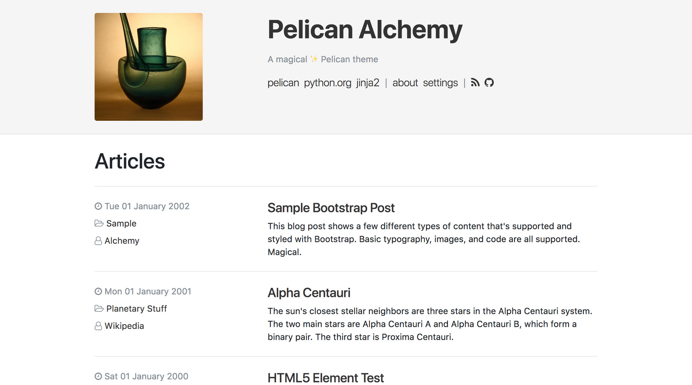

# boots4pelican

> A slightly more magical ✨ Pelican theme

boots4pelican is built on top of the Alchemy theme.

## boots4pelican Installation

All installation steps from the original Alchemy repo still apply here, with a few additional dependencies added so that you can leverage SASS during your static site buildout!

This theme relies on the [assets plugin](https://github.com/getpelican/pelican-plugins/tree/master/assets) - which is included as a project dependency in `requirements.txt`.

You will also need [Ruby Sass](https://sass-lang.com/ruby-sass) installed on your machine to compile the css locally.

This theme uses the [7-1 pattern](https://sass-guidelin.es/#the-7-1-pattern). All `scss` files needed for the project are imported into `scss/main.scss`. This file is then compiled and linked in `templates/base.html`.

```
    <link rel="stylesheet" href="{{ SITEURL }}/{{ ASSET_URL }}">

```

## The original documentations for Alchemy is intact below:

Alchemy is a functional, clean, responsive theme for the [Pelican](http://getpelican.com) static site generator.

Inspired by [crowsfoot](http://github.com/porterjamesj/crowsfoot) and [clean-blog](https://github.com/BlackrockDigital/startbootstrap-clean-blog), it features:

- Powered by [Bootstrap 4](https://getbootstrap.com/) (v4.0.0-beta.3)
- [Font Awesome](http://fontawesome.io/) icons
- [Pygments](http://pygments.org/) syntax highlighting styles
- Pelican `sitemap.xml` support
- [Favicon Generator](http://realfavicongenerator.net/) support
- External analytics ([Google](https://analytics.google.com), [Gauges](https://gaug.es), [Piwik](https://piwik.org)) support **
- External comments ([Disqus](https://disqus.com)) support **

** Features link to external assets (webfonts etc).



## Installation

Clone the repo:

```bash
git clone https://github.com/nairobilug/pelican-alchemy
```

Set the `THEME` variable in your Pelican config:

```python
THEME = '<PATH_TO_REPO>/alchemy'
```

### As a Submodule

In your Pelican site:

```bash
mkdir themes
git submodule add https://github.com/nairobilug/pelican-alchemy themes/pelican-alchemy
```

And in Pelican config:

```python
THEME = 'themes/pelican-alchemy/alchemy'
```

## Usage

Visit the [Settings wiki](https://github.com/nairobilug/pelican-alchemy/wiki/Settings) for examples:

- **SITESUBTITLE**: Subtitle that appears in the header.
- **SITEIMAGE**: Image that appears in the header.
- **DESCRIPTION**: Index HTML head `<meta>` description.
- **LINKS**: A list of tuples (Title, URL) for menu links.
- **ICONS**: A list of tuples (Icon, URL) for icon links.
- **PYGMENTS_STYLE**: Built-in Pygments style for syntax highlighting.
- **HIDE_AUTHORS**: Hide the author(s) of an article - useful for single author sites.
- **RFG_FAVICONS**: Use a Favicon Generator package.

Misc settings:

- **DISQUS_SITENAME**
- **GAUGES**
- **GOOGLE_ANALYTICS**
- **PIWIK_URL**
- **PIWIK_SITE_ID**

Example [pelicanconf.py](https://github.com/nairobilug/pelican-alchemy/blob/demo/pelicanconf.py) (demo website).

### Tips & Tricks

https://github.com/nairobilug/pelican-alchemy/wiki/Tips

## How to Contribute

1. Check for open issues or open a fresh issue to start a discussion around a feature idea or a bug.
1. Fork [the repository](https://github.com/nairobilug/pelican-alchemy) on GitHub to start making your changes to the master branch (or branch off of it).
1. Send a pull request and bug the maintainer until it gets merged and published. :)

Alchemy follows the [Contributor Covenant](CODE_OF_CONDUCT.md) code of conduct.

## License

[MIT](LICENSE) © 2017 Nairobi GNU/Linux Users Group
